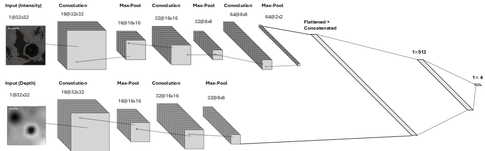
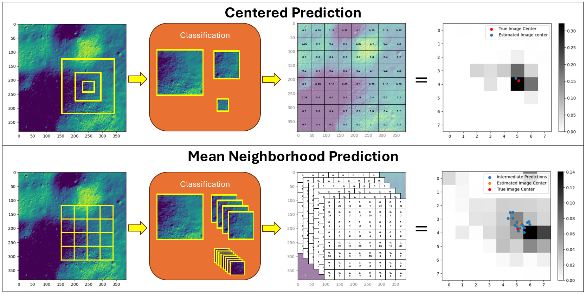

# Probabilistic regression for autonomous terrain relative navigation via multi-modal feature learning
You can find the full paper [HERE](https://www.nature.com/articles/s41598-024-81377-z)


## Architecture

The proposed architecture uses two modalities: depth and intensity (black and white). The respective modes have been optimized individually for better performance.

## Pre-requisites
This has been tested with  
python == 3.10  
torch == 2.5.1+cu124


## Dataset generation
You can retrieve the Apollo 16 Landing Site DTM(Digital Terrain Model) from [HERE](https://wms.lroc.asu.edu/lroc/view_rdr_product/NAC_DTM_APOLLO16).
Further image cropping is necessary because the initial DTM is very large. You can simply do:

```bash
from PIL import Image
import numpy as np

Image.MAX_IMAGE_PIXELS = None
image = Image.open({your_file_path})
cropped_img = np.asarray(image)[row_start:row_end, col_start:col_end]
```
You need to set the maximum image pixel to $None$ to load the tiff image.  
In the dataset folder, there is '_data_prep_final.py_'. You can use this to create the dataset.

## Training and testing
_train.py_ provides a sample code for level 1 (First layer of the cascading network). You can change the image path to yours.

## Regression
We came up with two different approaches to convert classification problem into localization regression. You can find the details in the full paper  [HERE](https://www.nature.com/articles/s41598-024-81377-z)  


## Bibtex
If you found this useful, please cite us 

```bash
@article{kim2024probabilistic,
  title={Probabilistic regression for autonomous terrain relative navigation via multi-modal feature learning},
  author={Kim, Ickbum and Singh, Sandeep},
  journal={Scientific Reports},
  volume={14},
  number={1},
  pages={1--16},
  year={2024},
  publisher={Nature Publishing Group}
}
```
